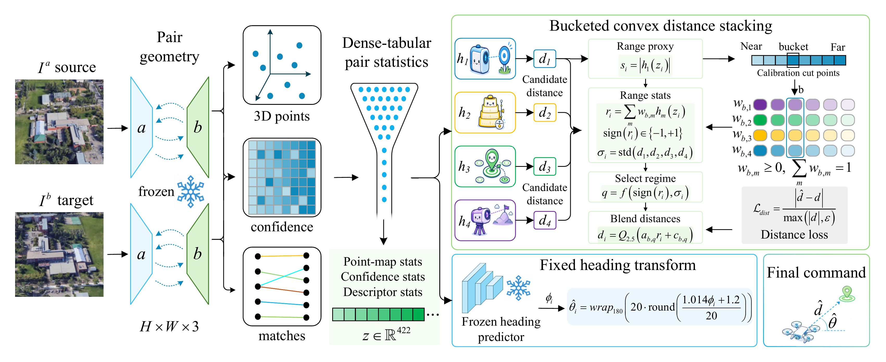
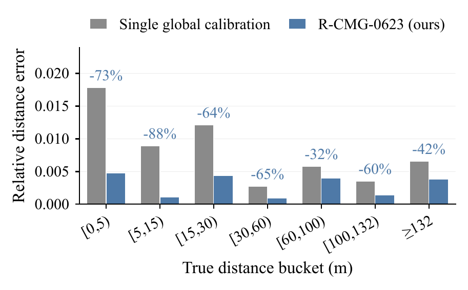

<div align="center">

# RASR：面向 PairUAV 的距离感知尺度恢复

**冻结成对几何、可复用尺度恢复，以及分离的 PairUAV 提交适配器。**

[English README](../README.md) · [复现说明](REPRODUCTION_zh.md) · [方法说明](METHOD_zh.md) · [合规说明](../compliance/COMPLIANCE_zh.md)




</div>

这是 **RASR（Range-Aware Scale Recovery）** 的公开实现。RASR 是论文
`Range-Aware Scale Recovery for Monocular Metric Grounding` 中描述的推理时冻结、
逐图像对系统。

论文将 PairUAV 表述为最后一米相对位姿估计中的 monocular metric grounding：给定
一对有顺序的图像，预测让智能体移动到目标视角的航向角和距离命令。冻结的成对几何
已经包含两张图像之间的相对结构；主要瓶颈是在相对误差目标下恢复正确的米制尺度。

RASR 明确区分两部分：

- **尺度恢复核心（scale-recovery core）**：冻结成对几何、422 维无元数据描述子、
  全局校准、四个在校准池上拟合且推理时冻结的距离候选，以及带分歧统计量的逐行凸混合。
- **PairUAV 基准提交适配器（benchmark submission adapter）**：距离分桶残差校正、
  提交量化，以及针对归档榜单提交使用的数据集调参常数。该适配器随代码发布以便复现，
  但不声明可直接迁移；部署时应丢弃或重新调参。

每个正式预测都是一个有序图像对和固定参数的函数。发布路径不使用测试集图优化、
batch 排序、隐藏邻居修正、隐藏测试集检索、全局分配、聚类或跨样本 bookkeeping。

## 复现路径

本仓库支持两条路径：

- **Path A，公开从头复现路径**：从官方数据构建 pair table，提取 pair feature，训练
  公开距离头和一个简单公开 heading baseline，执行推理，并打包一个合法的 PairUAV
  提交。这一路径用于透明端到端执行和独立实验；不期望逐 bit 复现归档线上分数。
- **Path B，精确冻结 artifact 路径**：下载冻结中间 CSV 包，先校验，再逐 bit 复现
  归档最终提交。当你需要论文中报告的精确线上结果时，使用这一路径。

精确冻结 artifact 路径复现的 `submit.zip` SHA-256 为：

```text
2f742f2eff83e535b96a8dbd46db370fa3ac0538a9f3e53b684d65c253b34b77
```

对应的 PairUAV 线上结果为：

| Metric | Value |
| --- | ---: |
| `final_score` | `0.003189` |
| `distance_rel_error` | `0.003029` |
| `angle_rel_error` | `0.003350` |

完整两路径协议见 `docs/REPRODUCTION_zh.md`。

## 文档

| 主题 | English | 中文 |
| --- | --- | --- |
| 项目概览 | [../README.md](../README.md) | [README_zh.md](README_zh.md) |
| 复现协议 | [REPRODUCTION.md](REPRODUCTION.md) | [REPRODUCTION_zh.md](REPRODUCTION_zh.md) |
| 方法说明 | [METHOD.md](METHOD.md) | [METHOD_zh.md](METHOD_zh.md) |
| 归档实现 | [METHOD_RELEASE.md](METHOD_RELEASE.md) | [METHOD_RELEASE_zh.md](METHOD_RELEASE_zh.md) |
| Heading 来源 | [HEADING_PROVENANCE.md](HEADING_PROVENANCE.md) | [HEADING_PROVENANCE_zh.md](HEADING_PROVENANCE_zh.md) |
| 合规说明 | [../compliance/COMPLIANCE.md](../compliance/COMPLIANCE.md) | [../compliance/COMPLIANCE_zh.md](../compliance/COMPLIANCE_zh.md) |
| 数据申请与目录结构 | [../data_processing/01_request_and_layout.md](../data_processing/01_request_and_layout.md) | [../data_processing/01_request_and_layout_zh.md](../data_processing/01_request_and_layout_zh.md) |
| 模型说明 | [../models/README.md](../models/README.md) | [../models/README_zh.md](../models/README_zh.md) |
| 许可证 | [../LICENSE](../LICENSE) | [../LICENSE_zh.md](../LICENSE_zh.md) |

## 方法摘要

尺度恢复核心从冻结 MASt3R-style ViT-L/16 metric checkpoint 提取的密集成对几何开始。
两张图像都被 resize 到 512 像素，并在两个方向上进行对称 pair inference。point maps、
cross-view point maps、confidence maps 和 descriptor maps 被归约为每个图像对一个
422 维无元数据描述子。

四个在校准池上拟合、推理时冻结的距离头产生具有互补距离段行为的候选结果：

- `distance_head_a`
- `distance_head_b`
- `distance_head_c`
- `distance_head_d`

尺度代理 `|h_1(z_i)|` 在发布配置中实现为 `gate=head0`，用于把每个图像对分配到
7 个距离 bucket 之一。bucket 的 calibration-side cut points 为：

```text
5.596117113284452, 14.189340747346009, 33.73144867309181, 53.75,
77.38132781381124, 114.79
```

在每个 bucket 内，四个候选结果由固定凸权重组合。这些权重通过 SLSQP 在距离相对误差
目标下拟合。四个候选结果的标准差被保留为 disagreement statistic。该路由混合定义
候选池和分歧信号；基准特定增益由单独的提交适配器实现。

PairUAV 基准提交适配器随后使用 `models/lastmeter_config.json` 中的固定
bucket/sign/std-segment affine correction 和 2.5 m 提交量化。heading 使用冻结
heading source，并接上论文中的固定变换：

```text
wrap_180(20 * round((1.014 * phi + 1.2) / 20))
```

self-pair 行通过同一行中的标识符检测，并只对该行设置为零 heading 和零 distance。

<p align="center">
  
</p>

## 数据

本仓库不分发数据集图像或标签。请从官方来源获取：

- University-1652：官方 University-1652 项目页面。
- PairUAV train/test data：官方 benchmark release。

期望的本地目录结构见 `data_processing/01_request_and_layout_zh.md`。

## 环境

```bash
conda env create -f environment.yml
conda activate pairuav-lastmeter
```

轻量 smoke test 会检查 stacker、circular heading utilities 和 self-pair handling：

```bash
bash scripts/smoke_test.sh
```

## Path A：公开从头复现路径

公开 from-scratch 脚本串联完整透明流程：

```bash
bash scripts/reproduce_from_scratch.sh \
  --data-root /path/to/pairuav-data \
  --output-dir outputs/from_scratch \
  --feature-mode smoke \
  --limit 4096 \
  --max-steps 50
```

完整 production-quality feature extraction 可能需要数天，具体取决于 GPU 数量和存储带宽。
如果使用 production features，请传入 `--feature-mode production`、`--runtime-root` 和
`--model-path`：

```bash
bash scripts/reproduce_from_scratch.sh \
  --data-root /path/to/pairuav-data \
  --output-dir outputs/from_scratch_production \
  --feature-mode production \
  --runtime-root /path/to/mast3r_probe_runtime \
  --model-path /path/to/MASt3R_ViTLarge_BaseDecoder_512_catmlpdpt_metric \
  --device cuda:0
```

`data_processing/03_extract_features.py` 有两种模式：

- `--mode smoke`：用于快速本地流程检查的确定性图像统计特征。
- `--mode production`：与发布 checkpoint contract 匹配的冻结视觉 pair features。它
  需要冻结视觉 runtime 和 model path，并支持 sharding、limit 和 resume。

production extractor 默认使用严格逐 pair forward pass。只有在以速度为主、可接受微小
数值漂移的实验中，才使用 `--batched-pair-forward`。

公开 from-scratch 路径从 pair features 训练一个简单的逐行 sin/cos heading baseline。
它用于公开完整工作流；如果需要精确归档分数，请使用 Path B。

## Path B：精确冻结 Artifact 复现

Path B 是唯一需要外部 artifact bundle 的路径。bundle 包含源码包、用于精确复现的
冻结逐行预测 CSV、checksum file 和归档 submit package。

- 百度网盘：https://pan.baidu.com/s/1K1gDMw8mLJwAFC6jO-c9Fg
- 提取码：`t2c6`
- Bundle 文件：`pairuav_lastmeter_complete_release_bundle.zip`
- Bundle SHA-256：

```text
4680537d47c93f6b953d20fde6e55b260e4603f02743b06f6ad6900ec0ef729f
```

从完整 bundle 中解出 `pairuav_lastmeter_frozen_artifacts.zip`。解压后的目录必须包含
四个距离头预测 CSV 和一个 heading CSV：

```text
/path/to/frozen_artifacts/
├── distance_head_a.csv
├── distance_head_b.csv
├── distance_head_c.csv
├── distance_head_d.csv
└── heading_predictions.csv
```

每个距离 CSV 必须包含 `range_pred`；heading CSV 必须包含 `heading_pred`。如果存在
`manifest_index`、`scene_id`、`pair_id`、`image_a`、`image_b` 等 metadata columns，
脚本会检查四个 head 之间的对齐，并用这些字段进行逐行 self-pair handling。

先校验下载的 artifacts：

```bash
python scripts/verify_frozen_artifacts.py \
  --artifact-root /path/to/frozen_artifacts \
  --manifest frozen_artifacts_manifest.json
```

运行精确复现：

```bash
bash scripts/reproduce_from_models.sh \
  --data-root /path/to/pairuav-data \
  --feature-root /path/to/frozen_artifacts \
  --output-dir outputs/exact
```

预期输出为：

```text
outputs/exact/submit.zip
```

预期 SHA-256 为：

```text
2f742f2eff83e535b96a8dbd46db370fa3ac0538a9f3e53b684d65c253b34b77
```

完整验证会检查 row count、self-pair zeroing、zip root contents 和期望 archive hash。
精确 hash 由五个冻结、逐行对齐的 prediction CSV 锚定。

## 从冻结 Pair Features 重新计算距离头

如果你有与发布 checkpoints 兼容的 422 维 pair feature cache，released-model 脚本可以先
重新计算四个距离头 CSV，然后再应用同一个 PairUAV 提交适配器：

```bash
bash scripts/reproduce_from_models.sh \
  --data-root /path/to/pairuav-data \
  --feature-root /path/to/features \
  --pair-feature-csv /path/to/pair_features.csv \
  --heading-csv /path/to/heading_predictions.csv \
  --output-dir outputs/released-models
```

对于 sharded caches，可使用 `--pair-feature-glob 'features/shard_*.csv'` 或
`--pair-feature-dir features/`。默认情况下，checkpoint inference 使用归档导出时的
per-head batch sizes；只有在可接受微小 runtime-dependent numeric drift 的实验中，才传入
`--no-legacy-batch-policy`。

小规模检查命令：

```bash
bash scripts/reproduce_from_models.sh \
  --data-root /path/to/pairuav-data \
  --feature-root /path/to/frozen_artifacts \
  --output-dir outputs/smoke \
  --limit 4096
```

## 验证命令

从对齐的 heading 和 distance CSV 打包：

```bash
python inference/package.py from-csv \
  --heading-csv /path/to/heading_predictions.csv \
  --distance-csv /path/to/distance_col.csv \
  --output-dir outputs/package
```

验证 result archive：

```bash
python scripts/verify_result.py \
  --result-zip outputs/package/result.zip
```

验证 feature CSV 是否匹配发布 checkpoint schema，也可选地对照冻结 reference cache：

```bash
python scripts/verify_features.py \
  --feature-csv outputs/features/pair_features.csv \
  --reference-csv /path/to/frozen_pair_features.csv \
  --checkpoint models/distance_head_a.pt \
  --limit 4096 \
  --atol 1e-5
```

## 仓库结构

```text
pairuav_lastmeter/
├── compliance/
├── configs/
├── data_processing/
├── docs/
├── inference/
├── models/
├── models_src/
└── scripts/
```

## 合规说明

推理是逐 pair 的。距离头和提交适配器阶段一次处理一个有序图像对，只使用该行的
预测结果和固定的 train/calibration-derived 参数。更多细节见 `compliance/COMPLIANCE_zh.md`
和 `docs/HEADING_PROVENANCE_zh.md`。
